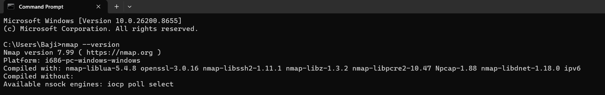
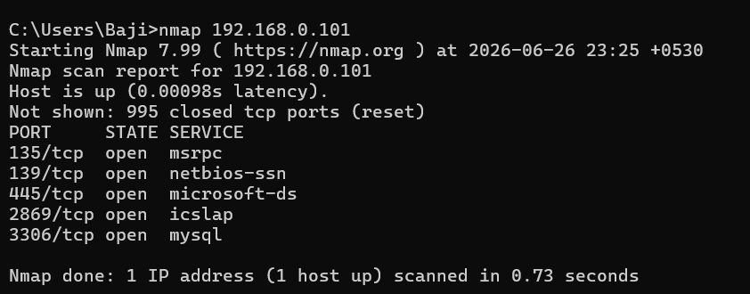
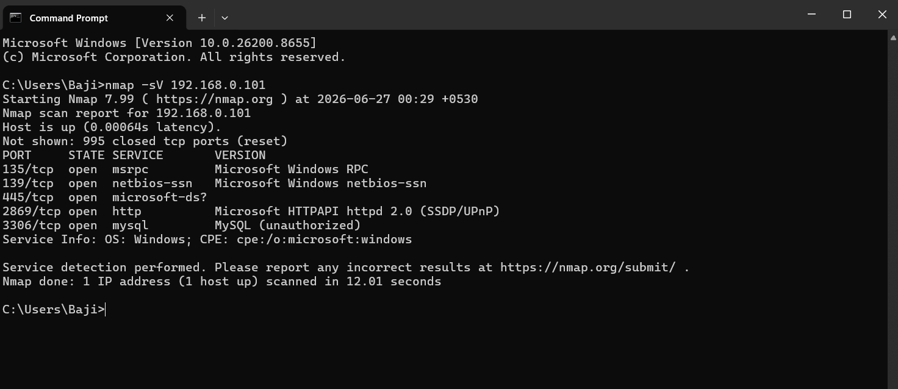

# Task 1: Basic Network Scanning with Nmap

## Objective

The objective of this task was to perform a basic network scan using Nmap to identify open ports and running services on a local Windows 11 machine. This task also involved analyzing the discovered services and understanding their significance from a cybersecurity perspective.

---

## Tools Used

- Nmap 7.99
- Windows 11
- Command Prompt (CMD)

---

## Prerequisites

- Nmap installed on the system
- Access to the target machine within the local network
- Basic knowledge of networking concepts

---

## Task Execution

### Step 1: Install Nmap

Nmap was downloaded from the official Nmap website and installed successfully on the Windows 11 system using the default installation settings.

> **Note:** Nmap is an open-source tool widely used for network discovery and security auditing.

---

### Step 2: Verify Installation

The following command was executed to verify that Nmap was installed correctly.

```bash
nmap --version
```

**Output**

```text
Nmap version 7.99
```

> **Observation:** The displayed version confirms that Nmap was installed successfully.

---

### Step 3: Perform Basic Network Scan

A basic network scan was performed using the following command.

```bash
nmap 192.168.0.101
```

**Purpose:** This command scans the target system to identify open TCP ports and the services associated with them.

---

### Step 4: Perform Service Version Detection

To identify the software versions running on the open ports, the following command was executed.

```bash
nmap -sV 192.168.0.101
```

**Purpose:** The `-sV` option enables service version detection and attempts to determine the application or software running behind each open port.

---

### Step 5: Save Scan Results

The following command was used to save the scan results into a text file.

```bash
nmap -sV 192.168.0.101 -oN nmap_scan_results.txt
```

The scan output was successfully saved as:

```text
nmap_scan_results.txt
```

> **Observation:** Saving the scan results allows future analysis and proper documentation.

---

## Screenshots

### Nmap Installation Verification



### Basic Network Scan



### Service Version Detection



---

## Scan Results

| Port | State | Service | Version |
| ---- | :---: | ------- | ------- |
| 135 | Open | msrpc | Microsoft Windows RPC |
| 139 | Open | netbios-ssn | Microsoft Windows NetBIOS Session Service |
| 445 | Open | microsoft-ds | Windows File Sharing Service |
| 2869 | Open | HTTP | Microsoft HTTPAPI httpd 2.0 (SSDP/UPnP) |
| 3306 | Open | MySQL | MySQL (Unauthorized) |

> **Observation:** The scan identified five open TCP ports running various Windows and database services.

---

## Findings

### Port 135 (MSRPC)

- Used for Microsoft Remote Procedure Calls (RPC).
- Enables communication between Windows services.
- Should be monitored to prevent unauthorized remote access.

### Port 139 (NetBIOS)

- Used for Windows file and printer sharing.
- May expose shared resources if not properly secured.

### Port 445 (SMB)

- Used by the Server Message Block (SMB) protocol.
- Supports Windows file sharing and network communication.
- Keeping SMB updated is important because it has historically been targeted by malware and ransomware.

### Port 2869 (HTTP)

- Associated with Microsoft's HTTPAPI service.
- Commonly used for SSDP and UPnP device discovery.

### Port 3306 (MySQL)

- Default port for the MySQL Database Server.
- Indicates that a MySQL service is running.
- Should be secured using strong credentials and restricted access.

---

## Security Recommendations

- Disable unused network services whenever possible.
- Restrict SMB and NetBIOS access to trusted systems.
- Protect database services using strong authentication.
- Regularly update Windows and all network services.
- Configure firewall rules to block unnecessary ports.
- Perform periodic network scans to identify newly exposed services.

---

## Learning Outcome

Through this task, I learned how to:

- Install and verify Nmap on Windows.
- Perform basic network scanning.
- Detect service versions using Nmap.
- Analyze open ports and the services running on them.
- Understand the security implications of exposed network services.
- Document technical findings in a professional GitHub repository.

---

## Repository Structure

```text
OIBSIP/
│
└── BajiShaik_Task1/
    │
    ├── README.md
    ├── nmap_scan_results.txt
    │
    └── screenshots/
        ├── nmap_version.png
        ├── basic_network_scan.png
        └── service_version_scan.png
```

---

## Conclusion

This task successfully demonstrated how to use Nmap to perform basic network reconnaissance on a Windows 11 system. The scan identified active services, open ports, and their associated software versions, providing valuable insight into the system's network exposure. Regular network scanning is an essential cybersecurity practice for identifying potential security risks and maintaining a secure environment.

---

## Author

**Baji Shaik**

Security Analyst Intern

**Oasis Infobyte**
